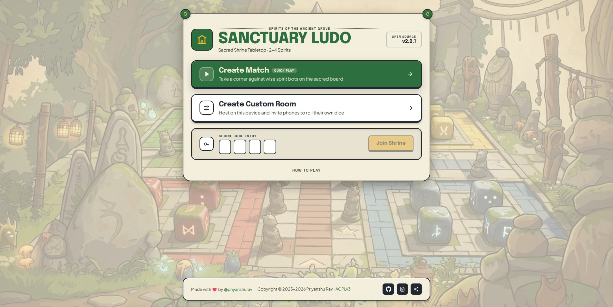
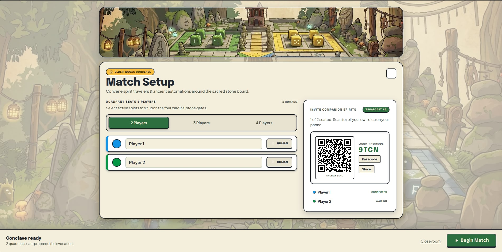
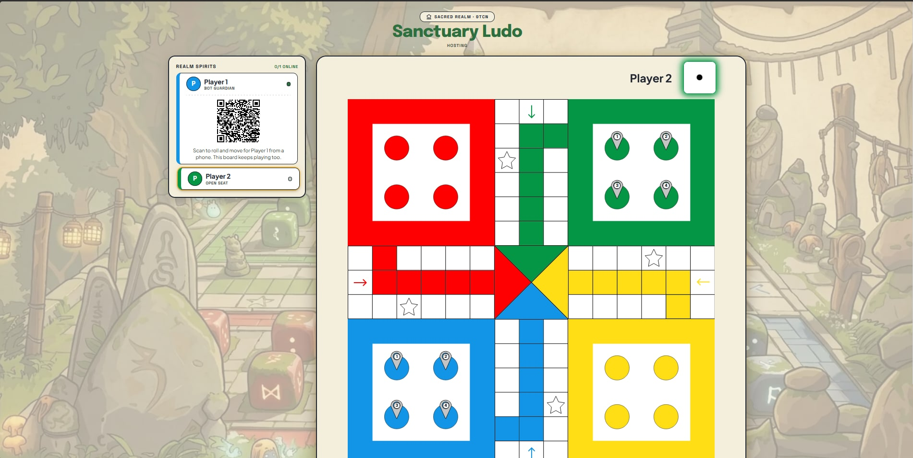
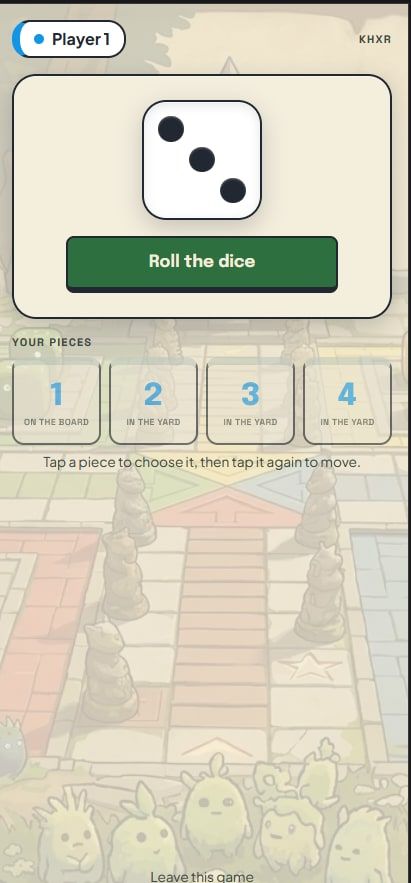

<p align="center">
  
</p>

<h1 align="center">🎲 LibreLudo · Sanctuary Edition</h1>

<p align="center">
  A modern, ad-free, open-source Ludo game — with networked rooms and phone controllers.
</p>

<p align="center">
  <a href="https://github.com/hell0beta/libreludo" target="_blank" rel="noopener noreferrer"></a>
  <a href="LICENSE" target="_blank" rel="noopener noreferrer"></a>
</p>

---

## 🔀 About this fork

This is a **modified version** of [LibreLudo](https://github.com/priyanshurav/libreludo) by
[Priyanshu Rav](https://github.com/priyanshurav). The original game — the board, the rules, the
bots, the design — is his. This fork is maintained by
[Hell0Beta](https://github.com/hell0beta), and the modifications are from 2026.

What changed here:

- **Networked rooms.** A host runs a room; other devices join with a four-character code.
- **Phone controllers.** A QR code takes a phone to a die-and-pieces panel, so a player rolls and
  moves from their handset while the board stays on a screen everyone can see.
- **A second PC at the table.** A PC that joins renders the real board — mirrored from the host —
  and plays its own colour from it, and can hand a phone that same seat by pairing.
- **A visual overhaul** onto the "Sanctuary Ludo" design system, and a Tailscale deploy path.

Upstream stays upstream: bug reports about the original game belong
[there](https://github.com/priyanshurav/libreludo/issues). Licensed under the AGPLv3, as the
original is — see [LICENSE](LICENSE). The **No Affiliation or Endorsement** section at the end of
this file applies to this fork as much as to any other.

---

## 🎮 Play LibreLudo

🟢 Run it yourself — see [`docs/deploy.md`](docs/deploy.md) for the Docker and Tailscale setup.
The menu's **Create Custom Room** opens a board and shows a QR code for phones.

---

## 📸 Screenshots

<div align="center">
  
</div>

<br />

|                                     Match Setup                                      |                                       The board                                        |
| :----------------------------------------------------------------------------------: | :------------------------------------------------------------------------------------: |
|  |  |

<br />

<div align="center">
  
</div>

<p align="center"><sub>The phone controller — a die, a roll, and your four pieces. In the board shot, player 1's card carries the QR that puts this on your phone.</sub></p>

---

## ✨ Features

- 🎮 **2–4 Player Local Matches** – Mix human and bot players on one device
- 📡 **Networked Rooms** – Host a board, and join it from other devices with a short code
- 📱 **Phone Controllers** – Scan a QR to roll and move from your handset, while the board stays on a screen everyone can see
- 🤖 **Bot Opponents** – Challenge computer players with basic strategy
- ⚛️ **React + Redux Toolkit** – Predictable and scalable game state
- 🚀 **Fast & Lightweight** – Built with Vite for high performance
- 📱 **Responsive** – Optimized for mobile, tablet, and desktop
- 📶 **Offline Support** – Play anywhere, even without an internet connection
- 💾 **Auto-Save Progress** – Your game state is saved automatically, so you can pick up right where you left off

---

## ⚙️ Tech Stack

- **React** + **Vite**
- **Redux Toolkit** for state
- **React Router** for prerendering and routing
- **TypeScript**
- **Vitest + React Testing Library** for testing
- **Socket.IO** for the room relay
- **Docker + Tailscale** for self-hosting

---

## 🗺️ Routes

| Path                | Description                                     |
| ------------------- | ----------------------------------------------- |
| `/`                 | Start menu                                      |
| `/setup`            | Match setup, and the invite QR when hosting     |
| `/play`             | Local hotseat game                              |
| `/room/:code`       | The host's tabletop                             |
| `/table/:code`      | The same board, on a PC that joined the room    |
| `/join/:code`       | Seat picker — where the QR lands                |
| `/controller/:code` | The phone: die and pieces                       |
| `/how-to-play`      | How to Play Guide                               |
| `*`                 | 404 Not Found                                   |

---

## Self-hosting on a Tailnet

The phone-controller feature needs a relay and a secure context, so it ships with a `Dockerfile`
and a `docker-compose.yml` that put the app behind `tailscale serve` (HTTPS, tailnet-only).
You need MagicDNS, tailnet HTTPS certificates, and an auth key — see
[docs/deploy.md](docs/deploy.md) for the prerequisites and the failure mode of each one.

```sh
cp .env.example .env    # add TS_AUTHKEY
docker compose up -d --build
```

---

## 🤝 Contributing

Contributions are welcome! Please read the [CONTRIBUTING.md](CONTRIBUTING.md) before opening an issue or pull request.

---

## 📜 License

This software is licensed under the GNU Affero General Public License, version 3. See the <a href="LICENSE" target="_blank" rel="noopener noreferrer">LICENSE</a> for more info. This fork is distributed under the same licence.

---

## ⚠️ No Affiliation or Endorsement

Forks, derivative works, modifications, and third-party projects based on or derived from LibreLudo are independent works. They are not affiliated with, sponsored by, endorsed by, or approved by the LibreLudo project or its maintainers. Use of this codebase does not imply any association with or approval from the LibreLudo project.
